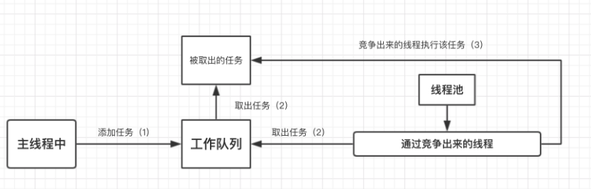

### 具体功能实现
GET方法请求解析
返回请求资源页面
HTTP请求行具体解析
400、403、404等HTTP返回码的处理

### 线程池的创建

我用的是半同步／半反应堆线程池。该线程池通用性比较高，主线程一般往工作队列中加入任务，然后工作线程等待后并通过竞争关系从工作队列中取出任务并且执行。而且应用到服务器程序中的话要保证客户请求都是无状态的，因为同一个连接上的不同请求可能会由不同的线程处理。

 
  
 

ps:若工作队列为空，则线程就处于等待状态，就需要同步机制的处理。 

### 同步机制的包装类

因为采用了线程池，就相当于用了多线程编程，此时就需要考虑各个线程对公共资源的访问的限制，因为方便之后的代码采用了三种包装机制，分别是信号量的类，互斥锁的类和条件变量的类。在服务器中我使用的是信号量的类。

### epoll多路复用 

 epoll系列系统调用函数(#include<sys/epoll.h>):

int epoll_create(int size);创建内核事件表

int epoll_ctl(int epfd, int op, int fd, struct epoll_event *event);操作epoll的内核事件表

int epoll_wait(int epfd, struct epoll_event *events, int maxevents, int timeout);一段时间内等待一组文件描述符上的就绪事件

除此这些函数外，还需要了解epoll的LT模式和ET模式还有EPOLLONESHOT事件.

下面三篇博客了解下：👇

https://blog.csdn.net/davidsguo008/article/details/73556811

https://blog.csdn.net/men_wen/article/details/53456491

https://blog.csdn.net/yusiguyuan/article/details/15027821

### 主要逻辑思路
首先创建和客户端的连接

服务器通过客户端的HTTP请求解析来判断返回何种结果.HTTP解析是以行为单位的，前提条件是根据\r\n来判断是否完整度入一行，若完整读入一行了那么就可以进行解析了。

通过HTTP请求的解析后，在写缓冲区写如HTTP响应，发送给客户端（HTTP应答包括一个状态行，多个头部字段，一个空行和资源内容，其中前三个部分的内容一般会被web服务器放置在一块内存中，而文档的内容通常会被放到另一个单独的内存中）

发送响应首行后，就可以发送主要的消息体了
